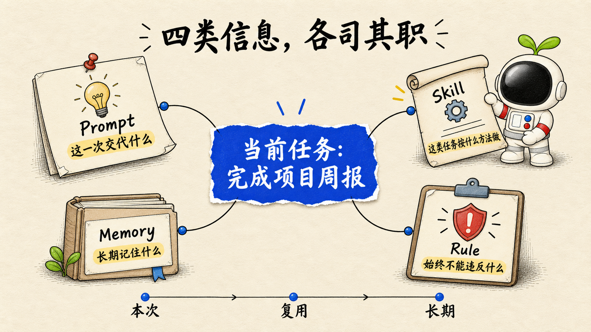

<p align="center">
  
</p>

<h1 align="center">纸蓝芽仔图解</h1>

<p align="center">
  一段内容，自动选对图解方式。
</p>

<p align="center">
  
  
  
  
</p>

把文章、教程、观点、流程和数据，自动转成统一的纸蓝芽仔视觉：低密度用场景隐喻，中密度用知识图解，高密度用信息可视化。用户只需提供内容，不必先选模式、拆节点或写生图提示词。

## 三种内容，一套画风

### 1. 场景隐喻 · 低密度


### 2. 知识图解 · 中密度



### 3. 信息可视化 · 高密度


> 示例图只定义视觉语言、信息密度与质量下限。每次生成都会根据当前内容重新建模，不复制示例的文字、物件、构图或芽仔动作。

## 它会自动做什么

- 判断内容是在讲“它像什么”“它是什么”，还是“它如何运行”。
- 在场景隐喻、知识图解、信息可视化之间自动路由。
- 根据文章、视频、小红书等用途选择 `16:9`、`4:3` 或 `3:4`。
- 高密度内容自动提取模块、规划页数、阅读路径和逐字文本。
- 用统一的暖纸底、Jacky 蓝、手写中文、手绘关系与芽仔动作完成表达。
- 生成后检查结构、文字、事实、角色身份、蓝色焦点和背景洁净度。

## 三档路由

| 模式 | 解决的问题 | 典型内容 | 结构限制 |
| --- | --- | --- | --- |
| 场景隐喻 | 让人一眼感受到一个观点 | 痛点、冲突、认知转折 | 1 个场景、1 个动作、0–3 个短标签 |
| 知识图解 | 解释“它是什么” | 组成、机制、分层、前后对比 | 1 个中心命题、3–5 个节点 |
| 信息可视化 | 解释“它如何运行” | 流程、时间线、因果、分支、循环、数据 | 自动拆页；每页通常 4–6 个模块 |

路由优先级：有精确步骤、日期、数值或依赖关系时使用信息可视化；没有严格顺序但需要解释结构时使用知识图解；只需要建立一个直观认知时使用场景隐喻。

## 使用

最简单的用法：

```text
使用 $jacky-illustration，为下面内容配图：

<粘贴文章、观点、教程、流程或数据>
```

也可以直接指定用途或画幅：

```text
使用 $jacky-illustration，把下面的流程做成 3:4 信息可视化。
```

只想先看方案时，明确说“先不要生成，只输出视觉规划”。

## 为什么生成更稳定

- 先定义“3 秒看见什么，随后理解什么”，再开始生成。
- 固定一张纸蓝芽仔身份锚点，角色造型与纸面媒介一起锁定。
- 每张图只有一个主蓝色语义焦点，蓝色必须承载重点。
- 高密度内容先规划结构和页数，不靠缩小文字硬塞。
- 日期、数量、单位、步骤和标签建立逐字清单。
- 结构错误才整体重生；文字、角色和微小脏点采用局部修复。

## 仓库结构

```text
Jacky-illustration/
├── SKILL.md
├── agents/openai.yaml
├── assets/
│   ├── examples/
│   │   ├── 01-scene-metaphor-16x9.png
│   │   ├── 02-knowledge-diagram-16x9.png
│   │   └── 03-information-visualization-16x9.png
│   └── ip/
│       ├── yazai-paper-blue-anchor-v1.png
│       └── yazai-canonical-front-v1.png
├── references/
│   ├── style-dna.md
│   ├── yazai-ip.md
│   ├── scene-metaphor.md
│   ├── knowledge-diagram.md
│   ├── information-visualization.md
│   └── qa-checklist.md
├── NOTICE.md
├── ASSET-LICENSE.md
└── LICENSE
```

## 安装

支持 GitHub Skill 导入的平台，可直接使用本仓库地址：

```text
https://github.com/Jackywxsz/Jacky-illustration
```

使用通用 Skills CLI：

```bash
npx skills add Jackywxsz/Jacky-illustration
```

安装到 Codex：

```bash
git clone https://github.com/Jackywxsz/Jacky-illustration.git ~/.codex/skills/jacky-illustration
```

## 边界

- 视觉封面不在本 Skill 范围内，应使用专门的封面工作流。
- 真实按钮、菜单路径和产品界面必须使用真实截图，不由图像模型伪造。
- 不虚构事实、日期、引用、来源、品牌、Logo、指标或成功状态。
- 图像模型生成的中文和数据仍需人工复核，尤其是高密度信息可视化。

## 致谢与授权

内容建模与信息结构方法受到 Ian 的 [Ian Xiaohei Scenes](https://github.com/helloianneo/ian-xiaohei-scenes) 和 [Ian Xiaohei Illustrations](https://github.com/helloianneo/ian-xiaohei-illustrations) 启发，两项上游项目均采用 MIT License。完整归属与适配说明见 [`NOTICE.md`](./NOTICE.md)。

Skill 指令与说明适用 [`LICENSE`](./LICENSE) 中的 MIT 条款。芽仔 IP 与原创视觉素材不包含在 MIT 授权内，详见 [`ASSET-LICENSE.md`](./ASSET-LICENSE.md)。
