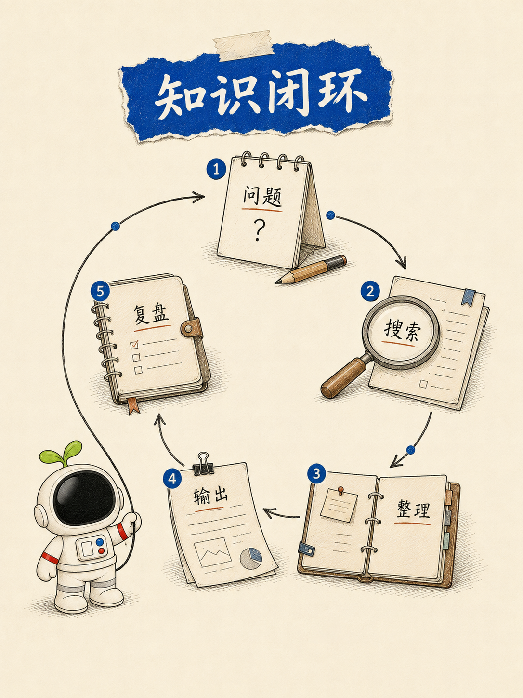

<p align="center">
  
</p>

<h1 align="center">Jacky 视觉图解</h1>

<p align="center">
  把中文文章、教程、观点、流程和数据，变成统一的「纸蓝芽仔」视觉。
</p>

<p align="center">
  
  
  
  
</p>

它不是一组通用插画 Prompt，也不是把所有内容塞进卡片墙。这个 Skill 会先判断信息密度，再选择场景隐喻、知识图解或信息可视化，并用同一套暖纸底、Jacky 蓝、手写字、手绘关系和芽仔动作完成表达。

## 看效果

| 场景隐喻 · 低密度 | 知识图解 · 中密度 |
| --- | --- |
|  |  |

<p align="center">
  
</p>

> 示例图是视觉与信息密度标尺，不是可照抄的模板。实际生成必须根据当前内容重新建模、重新构图，并逐字核对文本与数据。

## 三档路由

| 模式 | 解决的问题 | 典型内容 | 结构限制 |
| --- | --- | --- | --- |
| 场景隐喻 | 让人一眼感受到一个观点 | 痛点、冲突、认知转折 | 1 个场景、1 个动作、0–3 个短标签 |
| 知识图解 | 解释“它是什么” | 组成、机制、分层、前后对比 | 1 个中心命题、3–5 个节点 |
| 信息可视化 | 解释“它如何运行” | 流程、时间线、因果、分支、循环、数据 | 自动拆页；每页通常 4–6 个模块 |

路由优先级很简单：有精确步骤、日期、数值或依赖关系，进入信息可视化；没有严格顺序但需要解释结构，进入知识图解；只需要建立直观认知，使用场景隐喻。

三种模式都支持 `16:9`、`4:3` 和 `3:4`。比例只改变构图，不删减必要信息。

## 为什么不容易跑偏

- 先写清“3 秒看见什么，随后理解什么”，再开始生成。
- 固定一张纸蓝芽仔身份锚点，角色造型与媒介语言一起锁定。
- 每张图只有一个主蓝色语义焦点，蓝色必须承载重点。
- 高密度内容先提取模块、规划页数和阅读路径，不靠缩字硬塞。
- 日期、数量、单位、步骤和标签建立逐字清单，错误必须修复。
- 结构错误才整体重生；文字、角色和微小脏点采用局部修复。

## 安装

克隆到 Codex Skills 目录：

```bash
mkdir -p "${CODEX_HOME:-$HOME/.codex}/skills"
git clone https://github.com/Jackywxsz/jacky-illustration.git \
  "${CODEX_HOME:-$HOME/.codex}/skills/jacky-illustration"
```

重新启动 Codex 或开启一个新任务，让 Skill 被重新发现。

## 使用

### 自动选择模式并生成

```text
使用 $jacky-illustration，把下面这篇文章做成一组正文配图。
根据内容密度自动选择模式，画幅使用 16:9。

<粘贴文章>
```

### 指定知识图解

```text
使用 $jacky-illustration，把“为什么好内容需要选题、证据、表达与复盘”
做成一张 4:3 知识图解。先提炼 3–5 个必要节点，再生成。
```

### 指定高密度信息可视化

```text
使用 $jacky-illustration，把下面的流程做成 3:4 信息可视化。
保留所有步骤名称、日期、数字和单位；内容过载时自动拆页。

<粘贴流程或数据>
```

只需要方案、不需要生图时，明确说“先不要生成，只输出视觉规划”。

## 工作流

```text
内容建模
  → 信息密度路由
  → 画幅选择
  → 页面与阅读路径规划
  → 逐张生成
  → 结构 / 文字 / 身份 / 画面 QA
  → 局部修复与交付
```

完整规则见 [`SKILL.md`](./SKILL.md)。三种模式的细节分别位于：

- [`scene-metaphor.md`](./references/scene-metaphor.md)
- [`knowledge-diagram.md`](./references/knowledge-diagram.md)
- [`information-visualization.md`](./references/information-visualization.md)
- [`qa-checklist.md`](./references/qa-checklist.md)

## 目录

```text
jacky-illustration/
├── SKILL.md
├── agents/openai.yaml
├── assets/
│   ├── examples/paper-blue/
│   └── ip/
├── references/
│   ├── style-dna.md
│   ├── yazai-ip.md
│   ├── scene-metaphor.md
│   ├── knowledge-diagram.md
│   ├── information-visualization.md
│   └── qa-checklist.md
├── NOTICE.md
├── ASSET-LICENSE.md
└── LICENSE
```

## 使用边界

- 封面不在本 Skill 范围内；Jacky 封面继续使用 `jacky-cover`。
- 真实按钮、菜单路径和产品界面必须使用真实截图，不由图像模型伪造。
- 不虚构事实、日期、引用、来源、品牌、Logo、指标或成功状态。
- 图像模型生成的中文和数据仍需人工复核，尤其是高密度信息可视化。

## 致谢

这个 Skill 站在 Ian（[@helloianneo](https://github.com/helloianneo)）两项开源工作的肩膀上：

- [Ian Xiaohei Scenes](https://github.com/helloianneo/ian-xiaohei-scenes)：启发了内容建模、真实物件场景、物理动作、母版选择与长卷叙事方法。
- [Ian Xiaohei Illustrations](https://github.com/helloianneo/ian-xiaohei-illustrations)：启发了教程与知识内容的信息结构分类，包括流程、系统局部、前后对比、分层、路线与小场景等模式。

本项目在此基础上完成了芽仔 IP 适配、纸蓝视觉统一、三档信息密度路由、三画幅支持、高密度自动拆页、精确文本门禁和分层修复规则。两项上游项目均采用 MIT License；原始版权声明与适配说明完整保留在 [`NOTICE.md`](./NOTICE.md) 中。

## License

说明文本与代码适用 [`LICENSE`](./LICENSE) 中的 MIT 条款。芽仔 IP 与视觉素材不包含在 MIT 授权内，详见 [`ASSET-LICENSE.md`](./ASSET-LICENSE.md)。
